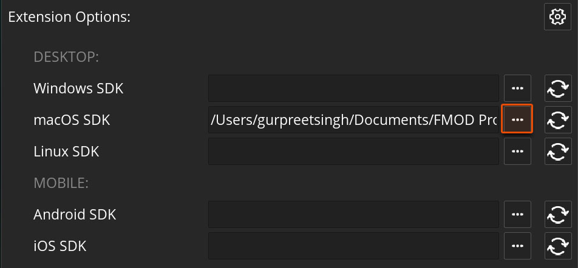

@title Getting Started with FMOD in GameMaker

# Setting Up FMOD

Go to [FMOD Downloads](https://www.fmod.com/download).

Download **FMOD Studio** and **FMOD Engine**. As of writing this guide, the latest version is 2.02.20, which is supported.


For **Studio**, download the package for the platform you are developing on.

For **Engine**, download packages for the platforms you want to publish your game to.

After installing the Engine API, open the installation and remember the location of the folder, which should contain the following folders in it ("api", "doc", etc.)


# Setting Up GameMaker

Download the latest package from the [Releases page](https://github.com/YoYoGames/GMEXT-FMOD/releases) of this repository.

Open your GameMaker project or create a new one.

Drag the `.yymps` file from the downloaded package into your GameMaker window, or go into **Tools -> Import Local Package** to select the `.yymps` file.


In the window that opens, select **Add All** and then **Import**.

In your Asset Browser, expand the "Fmod" folder, expand "Extensions", and double-click on **FMOD**.


This will open the Extension Editor which contains the extension's parameters.

Here you need to set the SDK locations for the platforms the game will be exported to. This needs the location of the FMOD Engine folder.



Here the Mac API is entered as the IDE is running on a Mac. Use the Browse `[...]` button to find and select your FMOD Engine directory (the folder that *contains* the "api" folder, not the "api" folder itself).

FMOD set-up is now complete. Let's look at how you can import banks from your FMOD Project and play events.

# Playing Events

> If you are not familiar with FMOD, [watch this tutorial](https://www.youtube.com/watch?v=7A1HMOsD2eU).

> This section covers how a bank is loaded and an event is started. For the rest of the functionality, view the [Function Reference in the Wiki](https://github.com/YoYoGames/GMEXT-FMOD/wiki). Every function listed in the wiki includes the name and documentation of its underlying FMOD API function, which is useful if you are following a tutorial that uses the original FMOD API functions.

Once you have set up your FMOD project, go to **File -> Build** to export the banks.

Copy the banks into the `datafiles` folder of your GameMaker project, to add them to your [Included Files](https://manual.gamemaker.io/monthly/en/Settings/Included_Files.htm).

In your game code, load your bank with ${func.fmod_studio_system_load_bank_file}:

```gml
bank_ref = fmod_studio_system_load_bank_file(fmod_path_bundle("master.bank"), FMOD_STUDIO_LOAD_BANK.NORMAL);
```

Then load your strings bank with ${func.fmod_studio_system_load_bank_file} so you can look-up events in the bank:

```gml
strings_bank_ref = fmod_studio_system_load_bank_file(fmod_path_bundle("master.strings.bank"), FMOD_STUDIO_LOAD_BANK.NORMAL);
```

Load the event description, using its name defined in FMOD Studio with the ${func.fmod_studio_system_get_event} function:

```gml
event_description_ref = fmod_studio_system_get_event("event:/Ambience/Country");
```

Create an instance of the event description before playing it, using ${func.fmod_studio_event_description_create_instance}:

```gml
event_description_instance_ref = fmod_studio_event_description_create_instance(event_description_ref);
```

Finally, play the instance so you hear sound using ${func.fmod_studio_event_instance_start}:

```gml
fmod_studio_event_instance_start(event_description_instance_ref);
```